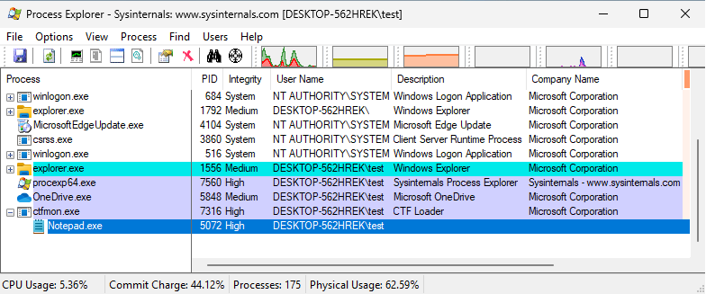
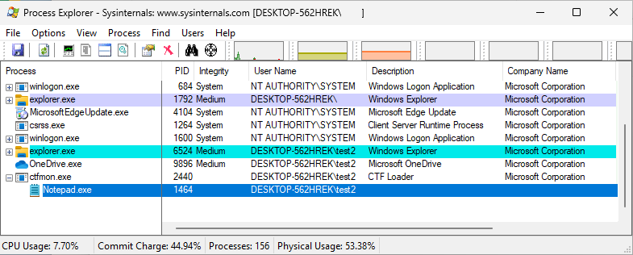

# Windows System Drive Remapping - Elevation of Privileges

This repository contains the code which reproduces the bug which we reported to Microsoft and which was presented at [Ekoparty 2023](https://ekoparty.org/eko2023-agenda/im-high).
The exploit executes a Notepad process running with elevated privileges. It's launched from the `ctfmon.exe` process.

If the current user is a member of the `Administrators` group (the default one), the Notepad process should look like this:

If the current user is a member of the `Users` group, the Notepad process should look like this:

## Obtaining `Administrator` privileges by chaining the attack

For the case where the current user is member of the `Administrators` group, it's possible to obtain `Administrator` privileges from the `ctfmon` process by following the steps described in our [Ekoparty 2023 presentation](https://labs.bluefrostsecurity.de/publications/2023/11/13/windows-system-drive-remapping-elevation-of-privileges/) in section "The Chain".

## Supported OSs

The exploit should work on the latest versions of Windows 10 (22H2) and Windows 11 (22H2/23H2).

## Requirements

Since the exploit creates the relative `.\windows\system32` subdirectory, it must be launched from a writable directory.

## Building instructions

Using the Visual Studio 64-bit command line compiler, just follow the steps bellow:

For setting the compiler environment
 - Execute `vcvars64.bat` (batch provided by Visual Studio)

For compiling the exploit:
 - Execute `cl.exe exploit.c`

For compiling the DLL:
 - Execute `cl.exe MsCtfMonitor.c /LD`

